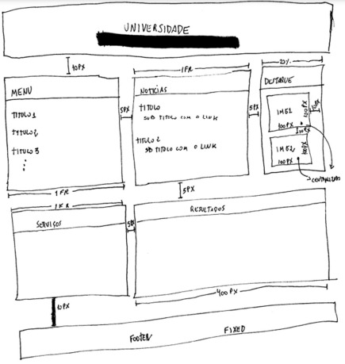
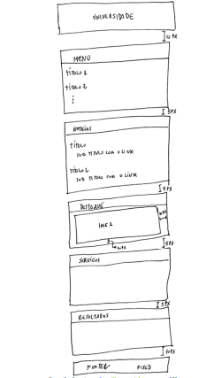

# Sobre

Esta pasta foi criada para incluir as soluções dos exercícios da segunda atividade prática do módulo de Front End da Residência em Software, realizada em colaboração entre o CEPEDI e a UESC.

# 📑Instruções práticas

> Desenvolvimento de um novo layout para o site da UESC. O design terá duas versões distintas, adaptando-se ao tamanho da tela do dispositivo que o acessa. Dispositivos com telas maiores que 500px seguirão o esboço da Figura 1, enquanto dispositivos com telas menores que 500px utilizarão o esboço da Figura 2 

>Para critério de avaliação da tarefa a ser entregue pelo aluno, será levado em consideração os seguintes itens que devem ser incluídos na elaboração do novo design:
>- Uso da propriedade display:grid;
>- Uso de pelo menos 3 fontes externas que podem ser pesquisadas no site do google Fonts;
>- Uso de um arquivo externo para a programação CSS;
>- Utilização de pelo menos 2 cores;
>- Utilização do modelo Box para separar os elementos HTML;
>- Uso da propriedade display: inline-block;
>- Considerar os espaçamentos descritos nos croquis;
>- Preencher quando possível a página com texto Lorem Ipsum.
>- Emprego da técnica de Media query para a criação de design responsivo.
>A tarefa pode ser feita por até 2 alunos.

# Autores

| [ Ana Caroline ](https://github.com/CarolineNeris) | 
|:-------------------------------------------------------------------------------------------------------------------------------------------------:|
